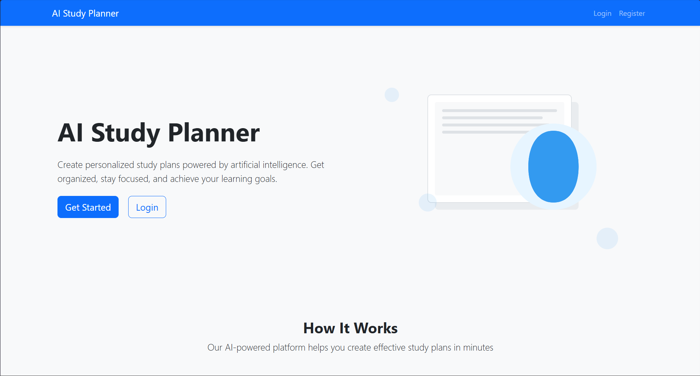
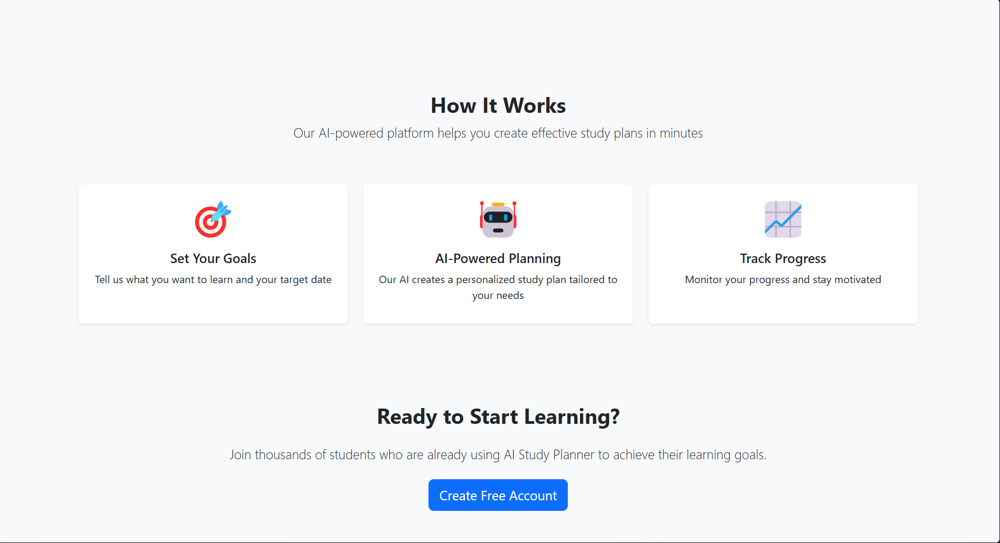
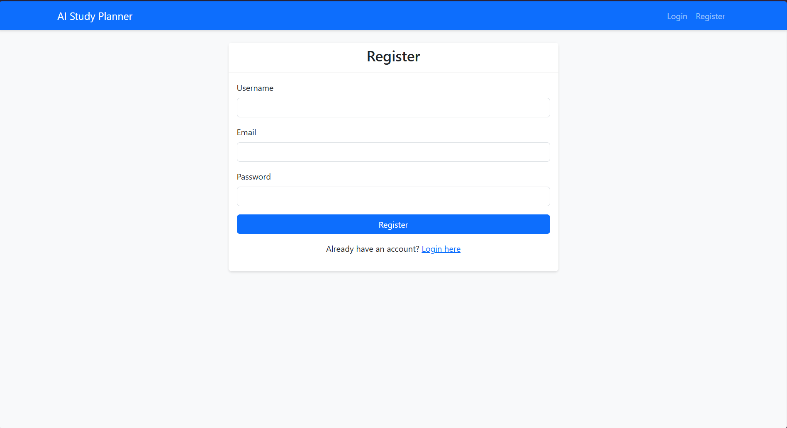
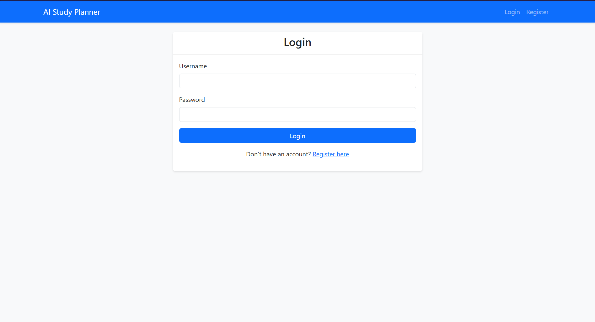
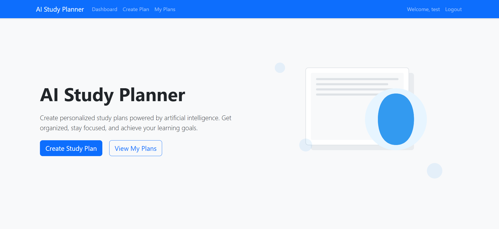
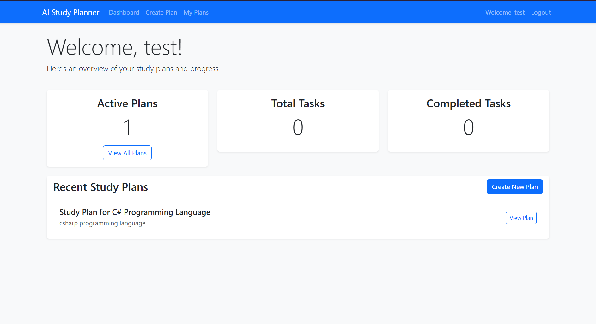
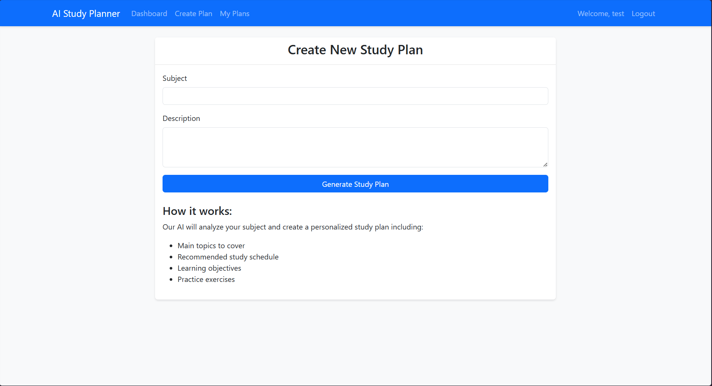
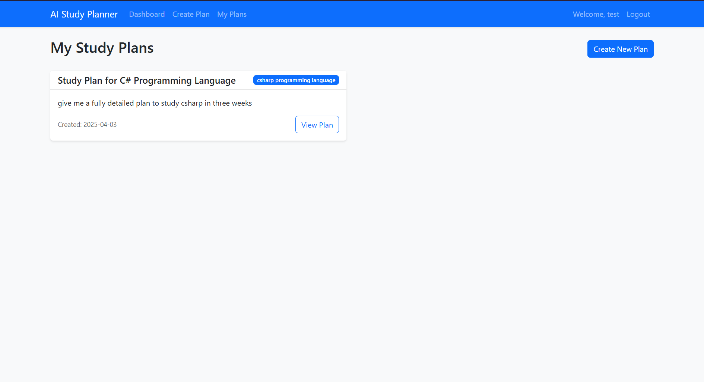
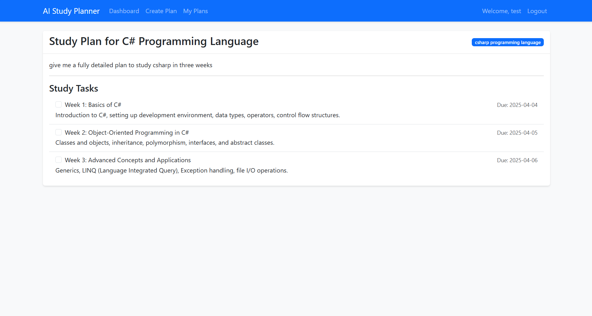

# AI Study Planner

A web application that helps students create personalized study plans using OpenAI's Assistant API.

## Features

- User authentication and registration
- AI-powered study plan generation
- Customizable study schedules
- Progress tracking
- Subject-specific study recommendations

## Setup Instructions

1. Clone the repository
2. Create a virtual environment:
   ```bash
   python -m venv venv
   source venv/bin/activate  # On Windows: venv\Scripts\activate
   ```
3. Install dependencies:
   ```bash
   pip install -r requirements.txt
   ```
4. Create a `.env` file in the root directory with your OpenAI API key:
   ```
   OPENAI_API_KEY=your_api_key_here
   SECRET_KEY=your_secret_key_here
   ```
5. Initialize the database:
   ```bash
   flask db init
   flask db migrate
   flask db upgrade
   ```
6. Run the application:
   ```bash
   flask run
   ```

## Application Screenshots

### Home Page


### Dashboard


### Create Study Plan


### View Study Plans


### Study Plan Details


### User Registration


### User Login


### Progress Tracking


### Task Management


## Project Structure

```
ai-study-planner/
├── app/
│   ├── __init__.py
│   ├── models/
│   ├── routes/
│   ├── static/
│   └── templates/
├── config.py
├── requirements.txt
└── run.py
```

## Environment Variables

- `OPENAI_API_KEY`: Your OpenAI API key
- `SECRET_KEY`: Flask secret key for session management
- `DATABASE_URL`: SQLite database URL (default: sqlite:///app.db)